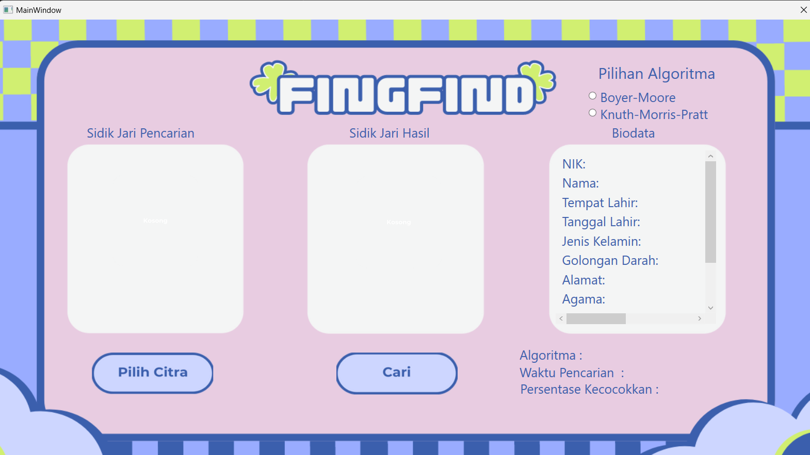
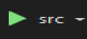

# Pemanfaatan _Pattern Matching_ dalam Membangun Sistem Deteksi Individu Berbasis Biometrik Melalui Citra Sidik Jari
Program untuk menemukan biodata dengan sidik jari yang paling mirip dalam basis data dengan sidik jari yang dimasukkan oleh pengguna.


## Table of Contents
* [General Info](#general-information)
* [Screenshots](#screenshots)
* [Requirements](#requirements)
* [Setup](#setup)
* [Usage](#usage)
* [Dibuat oleh](#dibuat-oleh)


## General Information
Program menggunakan algoritma Knuth-Morris-Pratt (KMP) atau algoritma Boyer-Moore (BM) untuk melakukan pencocokan sidik jari. Setelah ditemukan sidik jari dalam basis data dengan nilai tingkat kemiripan tertinggi, akan dilakukan pencocokan menggunakan ekspresi reguler (Regex) untuk mencocokkan nama yang terdapat pada tabel sidik jari dengan nama yang terdapat pada tabel biodata.  
- Algoritma KMP  
Algoritma ini akan mencari kemunculan pola dalam sebuah teks dengan arah _left-to-right_ dan menggunakan sebuah _array_ border function yang berfungsi untuk menentukan besar lompatan yang dapat diambil ketika terjadi _mismatch_.  
- Algoritma BM  
Algoritma ini akan mencari kemunculan pola dalam sebuah teks dengan arah _right-to-left_ dan menggunakan sebuah _array_ last occurence function yang berisi indeks kemunculan terakhir setiap karakter dalam pola untuk menentukan besar lompatan yang diambil ketika terjadi _mismatch_.  
- Regex  
Program memiliki kelas Regex yang bertujuan untuk mengonversi data korup yang mungkin terjadi di atribut nama pada tabel sidik_jari menjadi karakter alfabet seluruhnya. Kemudian, kelas Regex akan mencari nilai atribut nama pada tabel biodata yang memiliki nilai kemiripan terbesar dengan hasil konversi data korup nama pada tabel biodata menggunakan Levenhstein Distance. 


## Screenshots


## Requirements
Berikut adalah komponen yang diperlukan untuk menjalankan program ini:
1. .NET versi 8.0, [Unduh di sini](https://dotnet.microsoft.com/en-us/download/dotnet-framework)
2. Server MySQL Community versi 8.0.37, [Unduh di sini](https://dev.mysql.com/downloads/windows/installer/8.0.html)
3. Framework SixLabors.ImageSharp 3.1.4 (untuk menghandle gambar) [Ikuti cara instalasinya di sini](https://www.nuget.org/packages/SixLabors.ImageSharp)
4. Library MySql.Data versi 8.4.0 [Ikuti cara instalasinya di sini](https://www.nuget.org/packages/MySql.Data)
5. Library Dapper versi 2.1.35 [Ikuti cara instalasinya di sini](https://www.nuget.org/packages/Dapper)
6. System.Drawing.Common versi 8.0.6 [Ikuti cara instalasinya di sini](https://www.nuget.org/packages/System.Drawing.Common/)

## Setup
Berikut merupakan hal-hal yang perlu dilakukan untuk menjalankan program:
- Pastikan semua [requirements](#requirements) untuk program ini sudah diinstal dan diunduh
- Lakukan _git clone_ repositori ini.
- Import database yang ingin digunakan atau buat database baru.
- Jika Anda menggunakan **Visual Studio Code**, buka folder _src_ dalam terminal dan masukkan perintah 
```bash
dotnet run
```
- Jika Anda menggunakan **Visual Studio**, buka file        ```Tubes3_Panitia-Persiapan-Platform-Based-Development.sln``` dan klik tombol build and run di Visual Studio. (Gambar tombol terletak di bawah ini) <br> 
- Jika Anda ingin membuka aplikasi ini tanpa menggunakan IDE, buka file     ```src/bin/src.exe```
## Dibuat oleh
Dibuat oleh:
| NIM      | Nama                    | Kelas                                                                                                                                                                                                               |
|----------|-------------------------|--------------------------------------------------------------------------------------------------------------------------------------------------------------------------------------------------------------------------------|
| 13522036 | Akbar Al Fattah            | K-02                                                              |
| 13522056 | Diero Arga Purnama         | K-02                                                              |
| 13522060 | Andhita Naura Hariyanto    | K-02                                                              |
